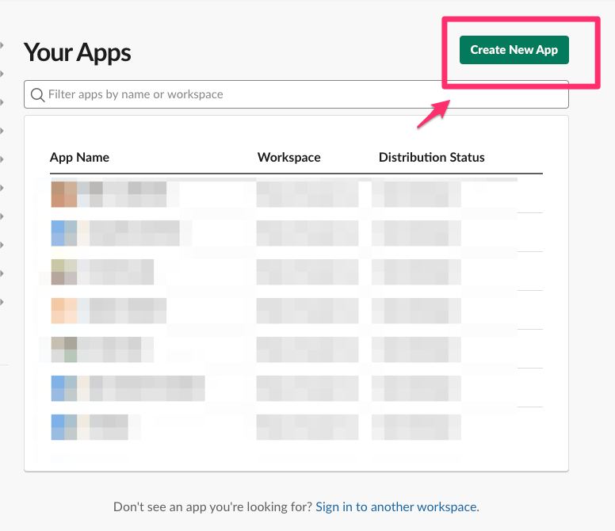
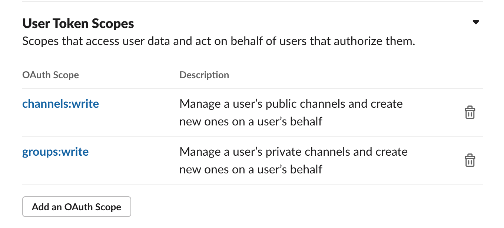

# このリポジトリは何ですか？

SlackチャンネルリネームbotをTerraformを用いてAWS Lambdaで実装するためのテンプレート用リポジトリです。

## 構成要素

チャンネルリネームbotは下記のような要素を用いて実現しています。

1. チャンネルリネーム用のSlack Appを作成。
2. 上記Slack AppでSlashコマンドを定義。
3. Slashコマンド実行時の要求先としてAmazon API GatewayのURLを指定。
4. Amazon API Gatewayに要求があった場合、AWS Lambda関数の「mf_kibela/terraform/lambda_src/incoming_main/lambda_function.py」を実行。
    - Slackの仕様として、3秒以内に応答を返す必要があるので、この関数では下記内容を実現しています。
      - 実際のチャンネル変更用のLambda関数を非同期で実行。
      - Slack側に応答を返す。
5. 上記関数から「AWS Lambda関数の「mf_kibela/terraform/lambda_src/main/lambda_function.py」」を実行。
    - AWS Lambda関数実行時に、AWS Systems ManagerのParameter StoreからSlack用のAPI Tokenを取得。

## 操作イメージ


## 導入手順

※下記はAWSアカウントを新規に作成した状態(何も設定されていない状態)での構築を前提にしています。
既存環境に組み込む場合は、ご自身の環境に適した読み替えをしてもらえればと思います。
また、本リポジトリを用いて環境を用意された場合、stateファイルはローカル環境に作成されます。
チームでコード管理等をされたい場合は、[backend](https://www.terraform.io/docs/language/settings/backends/index.html) の定義もご自身で検討、導入ください。

### Terraform実行環境を用意

Terraformの導入手順については[Google検索](https://www.google.com/search?q=terraform+aws+%E3%81%AF%E3%81%98%E3%82%81%E3%82%8B&ei=WVxTYI3iG6jY-Qakzq_gBg&oq=terraform+aws+%E3%81%AF%E3%81%98%E3%82%81%E3%82%8B&gs_lcp=Cgdnd3Mtd2l6EAMyBAghEBU6CAgAELADEM0COgUIABDNAlD4MlipN2CcOWgBcAB4AIABgwGIAcgEkgEDMS40mAEAoAEBqgEHZ3dzLXdpesgBBcABAQ&sclient=gws-wiz&ved=0ahUKEwjN8o_f_7nvAhUobN4KHSTnC2wQ4dUDCA0&uact=5)してもらえれば文献は多数あるので、割愛します。

### Terraformにてbot動作環境を構築

1. AWS環境でterraform用のIAMユーザーを作成(AdministratorAccessを付与しておくのが間違いないです)
1. ターミナルソフト(iTerm/Terraterm...等)を起動
1. 下記を実行。
   - ```
     本リポジトリをclone( )
     cd terraform
     export AWS_ACCESS_KEY_ID="<上記で作成したIAMユーザーのACCESS KEY ID>"
     export AWS_SECRET_ACCESS_KEY="<上記で作成したIAMユーザーのACCESS KEY のsecret>"
     terraform init
     terraform apply
     ```
1. 上記 `terraform apply` 実行後にOutputsという実行結果に `api_gateway_url` という値が出力されているのでその値にて出力されているURLをメモする。

### Slack Appを用意

1. **SlackのOwner権限以上のユーザーでログインした状態** でhttps://api.slack.com/apps にアクセス。
2. [Create New App]を選択。
   - 
3. [Create a Slack App]というダイアログが出てくるので、bot名とbot作成先のSlack Workspaceを指定する。
4. [Slash Commands]メニューから[Create New Command]で新規スラッシュコマンドを作る
   - 例
      - **Command**
        - /rename-channel
      - **Request URL**
        - <「Terraformにてbot動作環境を構築」の作業内でメモしたapi_gateway_urlのURL>
      - **Short Description**
        - SlackチャンネルをrenameするだけのSlash Command
      - **Usage Hint**
        - /rename-channel <<変えたいチャンネル名>>

4. [OAuth & Permissions]メニューの[User Token Scopes]にて、下記画像のようにScopeを定義する。
   - 
5. [Install App]メニューから[Install to Workspace]を実行し、アプリを有効化する。
6. [Install App]メニューから[User OAuth Token]をメモする。
7. [Basic Information]メニューから[Signing Secret]の値をメモする。

### AWS Systems ManagerのParameter StoreにSlack Appのクレデンシャル情報を登録

1. AWSコンソールを開く。
2. パラメータストア(https://ap-northeast-1.console.aws.amazon.com/systems-manager/parameters/)を開く。
3. **/slack_channel_rename/user_oauth_token** に「Slack Appを用意」でメモした[User OAuth Token]の値を登録
3. **/slack_channel_rename/signing_secret** に「Slack Appを用意」でメモした[Signing Secret]の値を登録

### 動作テスト

「Slack Appを用意」で定義したslash commandを利用してチャンネル名を変更してみる。(例: `/rename-channel <変更したいチャンネル名>` )